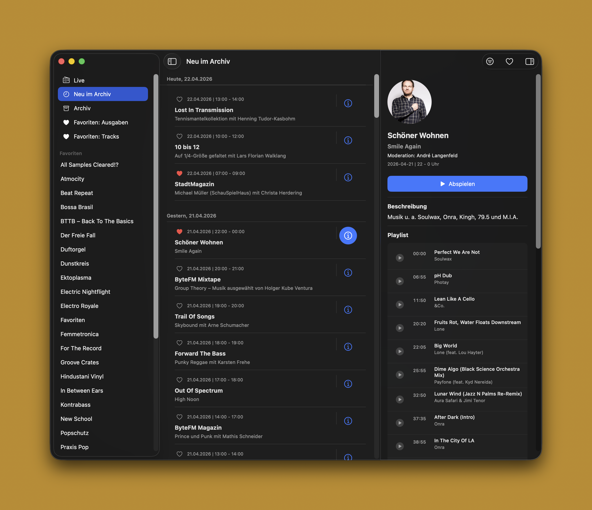
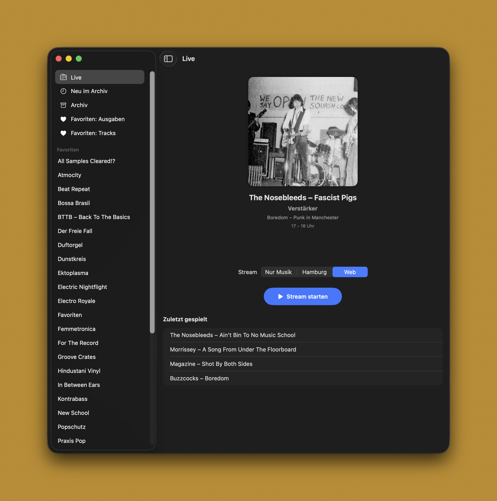
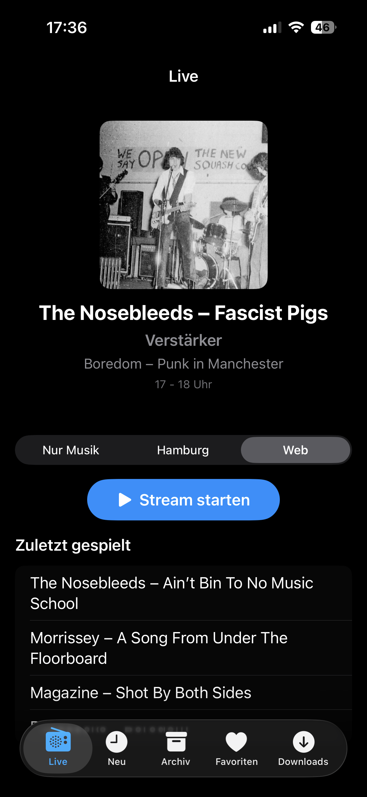
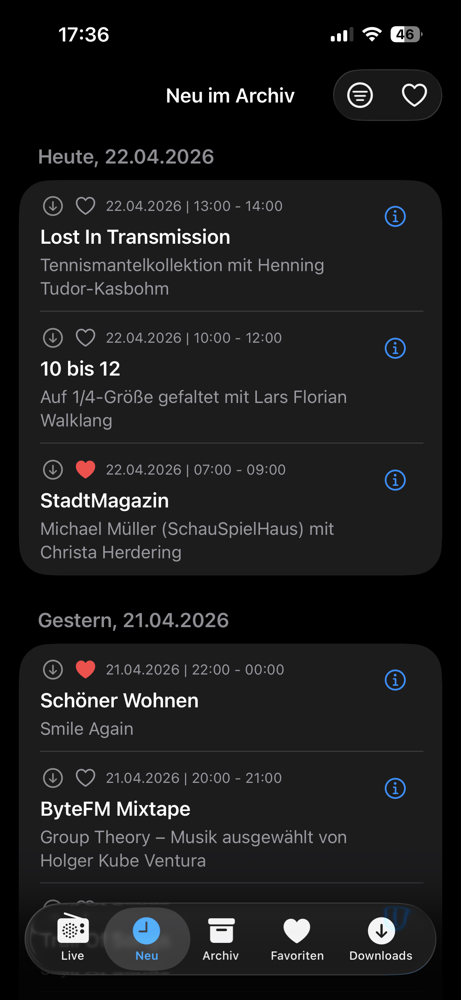
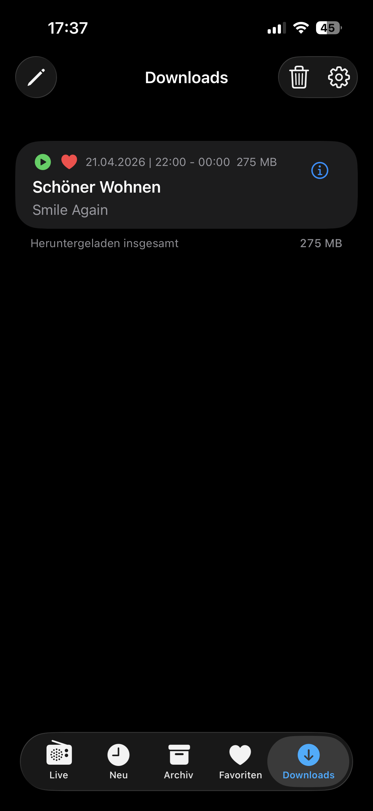

# BiteFM (macOS + iOS)

Ein nativer Client für den Radiosender [ByteFM](https://www.byte.fm). Von einem ByteFM-Fan für Byte-FM-Fans.

**HINWEIS: IN ENTWICKLUNG! Der Client funktioniert grundsätzlich, aber ist noch in Entwicklung. Bitte erstmal nur zu Testzwecken nutzen.**

## Screenshots v0.3

### macOS

### iOS
  

## Hauptmerkmale

###  Live-Streaming
- **Drei Stream-Varianten**: Direkter Zugriff auf die Streams "Web", "Hamburg" und "Nur Musik".
- **Echtzeit-Metadaten**: Anzeige des aktuellen Titels, Künstlers und der Sendungsinformationen.
- **Titel-Historie**: Übersicht der zuletzt gespielten Songs für alle Livestreams.
- **Visuelle Details**: Anzeige von Künstlerbildern (sofern verfügbar) direkt in der Live-Ansicht.

###  Umfangreiches Archiv ("Neu im Archiv")
- **Lokale Datenbank (SwiftData)**: Alle Archiv-Sendungen werden lokal in einer SwiftData-Datenbank gespeichert, was schnelles Scrollen und Offline-Einsicht ermöglicht. Ausserdem hat man mehr als nur die letzten paar Sendungen die Neu sind.
- **Intelligente Bereinigung**: Automatische Löschung von Sendungen, die älter als 4 Wochen sind.
- **Show-Details im Inspector**: Detaillierte Informationen zur Sendung (Playlist, Beschreibung) sind verfügbar. Man kann zu jedem Song direkt springen.

###  Player & Bedienung
- **Vollständige Medientasten-Unterstützung**: Steuerung von Play/Pause sowie das Springen zwischen Songs (im Archiv) über die Medientasten.
- **Interaktive Playlisten**: Ein Klick auf einen Song in der Playlist springt direkt zum entsprechenden Zeitstempel in der Archiv-Aufnahme.
- **Song-zu-Song Navigation**: Unterstützung für "Nächster Titel" und "Vorheriger Titel" innerhalb von Archiv-Sendungen.
- **Now-Playing Anzeige**: Integration in das macOS Kontrollzentrum und den Sperrbildschirm mit detaillierten Song-Informationen ("Interpret — Titel" und "Sendung — Ausgabe").
- **Visuelles Feedback**: Anzeige des Ladestatus (Buffering) und Hervorhebung des aktuell spielenden Songs in der Playlist.

###  Sicherheit & Komfort
- **Sicherer Login**: Verschlüsselte Speicherung der ByteFM-Zugangsdaten im macOS Schlüsselbund (Keychain) (TODO, aktuell nicht umgesetzt).
- **Auto-Login**: Automatisches Anmelden beim App-Start für direkten Zugriff auf den Mitgliederbereich.

## Technische Basis
- **SwiftPM-Package**: Library `BiteFMCore` + ausführbares `BiteFMMac` für `swift build` / CLI.
- **SwiftUI**: Adaptive UI (regular vs. compact) für Mac und iPhone.
- **SwiftData**: Persistente Speicherung und Abfrage von Archiv-Daten.
- **AVFoundation (AVPlayer)**: Hochwertige Audio-Wiedergabe und Streaming-Management.
- **MediaPlayer Framework**: Systemweite Integration der Wiedergabesteuerung.
- **xcodegen**: Xcode-Projekt mit zwei App-Targets (Mac + iOS) und lokalem SPM-Package.

---
*Hinweis: Dies ist ein inoffizieller Client und steht in keiner direkten Verbindung zur ByteFM GmbH.*
